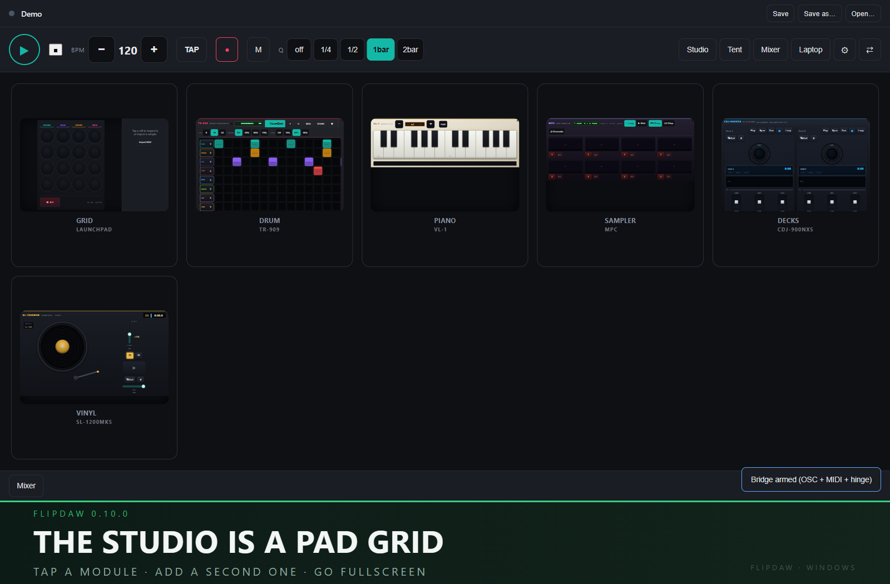
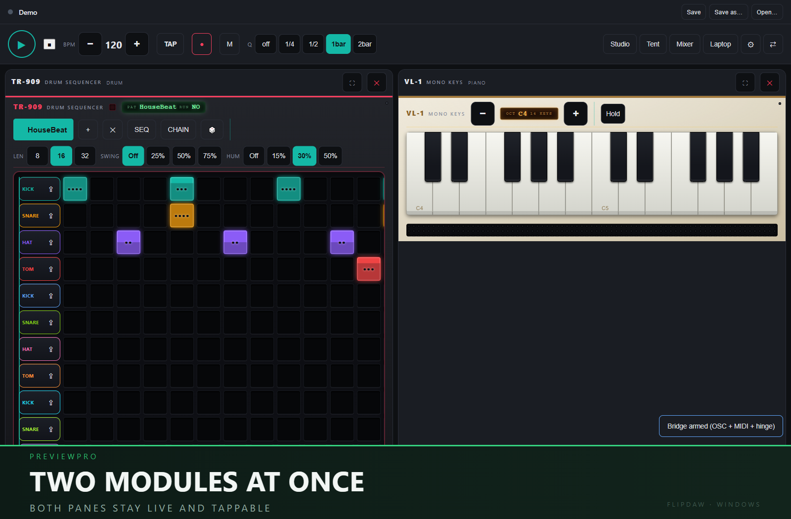
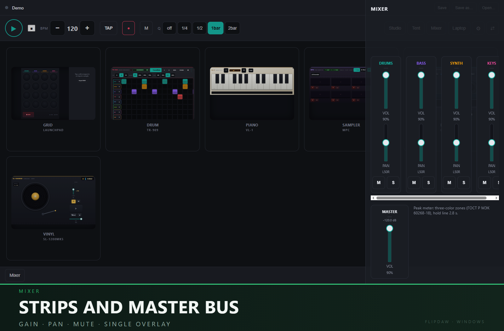
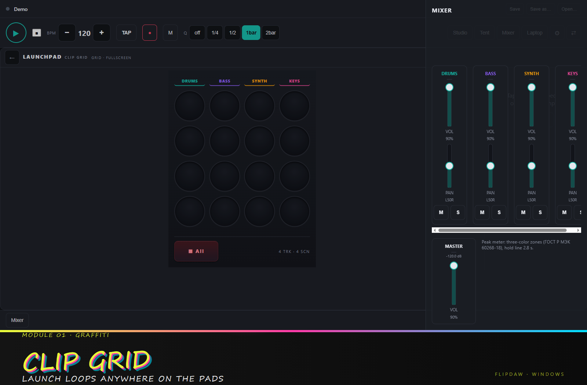
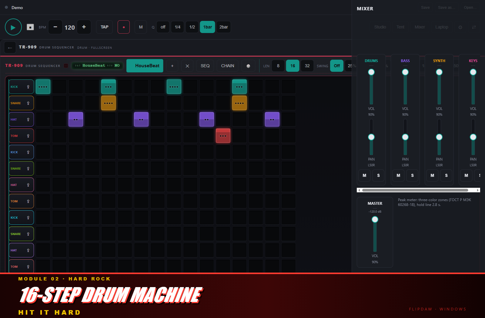
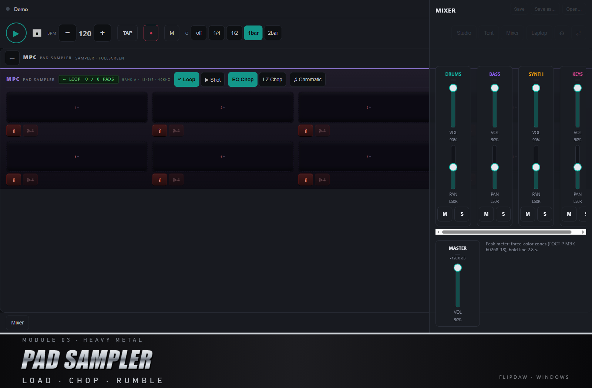
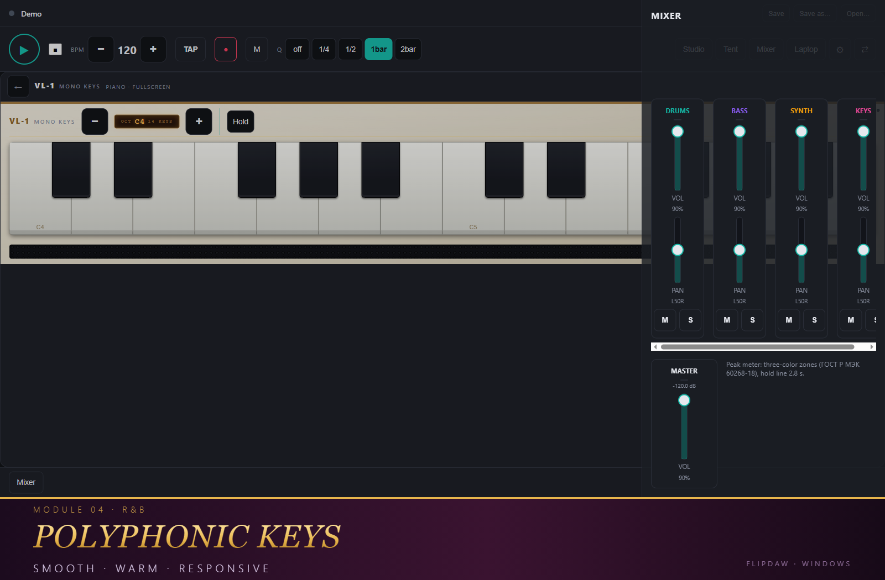
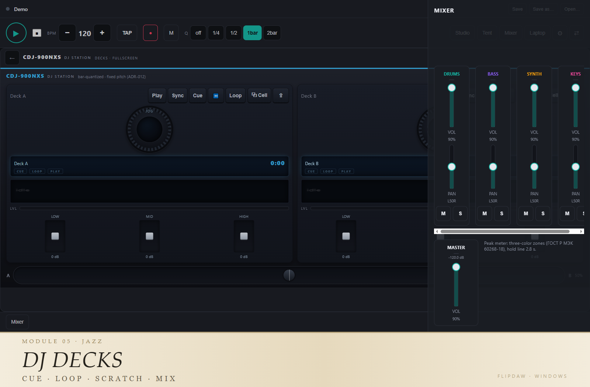
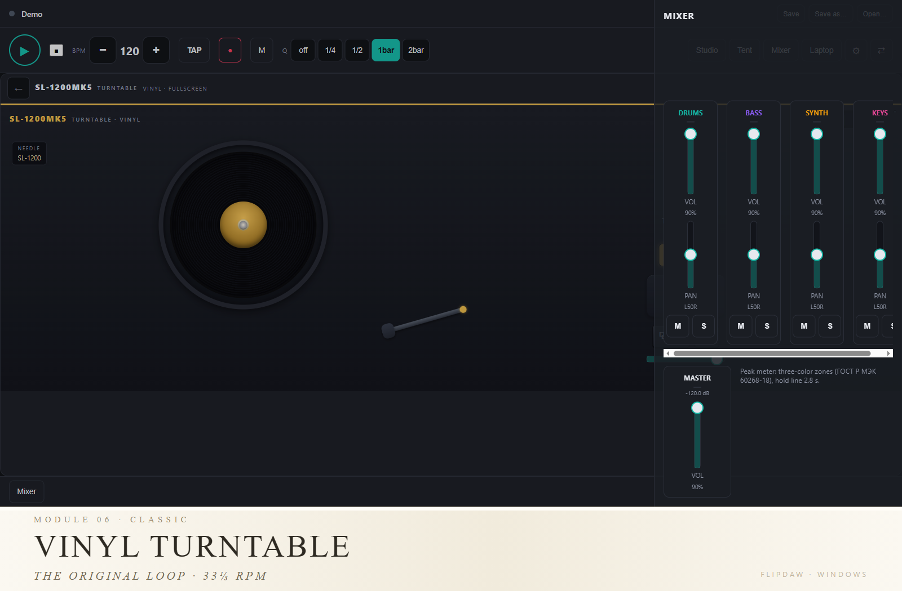

# FlipDAW

**Touch-first DAW / loop station for Windows laptops and 2-in-1 devices.**
The whole studio is a grid of pads — tap a module to bring it to the front, add a second
one side by side, or expand it to fullscreen.

[](LICENSE)



## Screenshots

### The studio

| previewPro — two live modules | Mixer |
|---|---|
|  |  |

### Modules

| | |
|---|---|
|  |  |
|  |  |
|  |  |

---

## Download

Grab the latest installer from the **Releases** section of this repository (the green
*Releases* link on the right-hand side of the GitHub page, or `/releases/latest`):

| File | Size | Notes |
|---|---|---|
| `FlipDAW_<version>_x64-setup.exe` | ~1.2 MB | NSIS installer, installs for the current user (no admin rights needed) |
| `FlipDAW_<version>_x64_en-US.msi` | ~1.8 MB | MSI package (requires admin, for managed deployment) |

**Windows 10/11, x64.** The installer pulls in the Microsoft Edge WebView2 runtime if it is
missing (needs internet on first install; Windows 11 ships with it already).

> The installers are **not code-signed yet**, so Windows SmartScreen will show
> *"Windows protected your PC"*. Click **More info → Run anyway**.
> See [SECURITY.md](SECURITY.md) for how we handle signing and reporting.

## Features

- **Pad-based studio canvas** — six modules live on a drum-machine-style pad grid; every
  miniature is a running instance of the real module.
- **previewPro** — a tapped module occupies half the canvas and stays interactive; a large
  "+" opens a picker to add a second module alongside it.
- **Fullscreen module** — expand any panel for full access, with the rest one tap away.
- **Modules** — clip grid, 16-step drum sequencer, 16×16 pad sampler, piano, DJ decks,
  turntable.
- **Hinge-aware layouts** — laptop / tent / mixer, driven by keyboard or the lid sensor.
- **Loop-station transport** — every start and stop is quantized and sample-accurate on the
  Web Audio clock (no `performance.now()` in the audio path, see ADR-001).
- **Human-readable projects** — `project.json` + `samples/` + `thumbs/`, no database, no
  telemetry, no network calls. Everything stays on your disk.

## Tech stack

| Layer | Tech |
|---|---|
| Shell | Tauri 2 (Rust + WebView2) |
| UI | React 19 + TypeScript (strict) + Vite |
| State | Zustand |
| Audio | Web Audio API, dual-clock architecture |
| Tests | Vitest (logic), Rust `cargo test`, headless-Chrome CDP smoke tests |

The desktop shell is a thin Rust core: filesystem access is sandboxed to the app-data
folder, and any folder outside it must be granted by the user through the native picker.
See [SECURITY.md](SECURITY.md).

## Build from source

### Prerequisites

- Node.js 20+ and npm
- [Rust](https://rustup.rs) (stable, MSVC toolchain)
- [Visual Studio Build Tools 2022](https://visualstudio.microsoft.com/downloads/) with the
  *Desktop development with C++* workload and a Windows 11 SDK

### Web app only

```bash
npm install
npm run dev        # Vite dev server on http://localhost:5173
npm test           # Vitest
npm run typecheck  # tsc --noEmit
npm run lint       # oxlint
npm run build      # production bundle in dist/
```

### Desktop app

```bash
npm run desktop:dev      # run the Tauri shell against the dev server
npm run desktop:build    # installers in src-tauri/target/release/bundle/
```

## Security

- `npm run security:scan` — supply-chain scanner (IOC blocklist, non-registry dependencies,
  untrusted crate sources, dangerous renderer sinks, committed secrets).
- `cargo audit` — RustSec advisories for the crate tree.
- Dependency installs are pinned; third-party packages are verified before adding.

## License

[MIT](LICENSE) © FlipDAW contributors

**Exception — `spike/juce-core/`:** that spike links against [JUCE](https://juce.com),
which is dual-licensed (GPLv3 / commercial). It is design documentation only: it is never
built or shipped with any release and is **not** covered by the MIT license above. The
released FlipDAW app is Rust + WebView2 and does not use JUCE.
